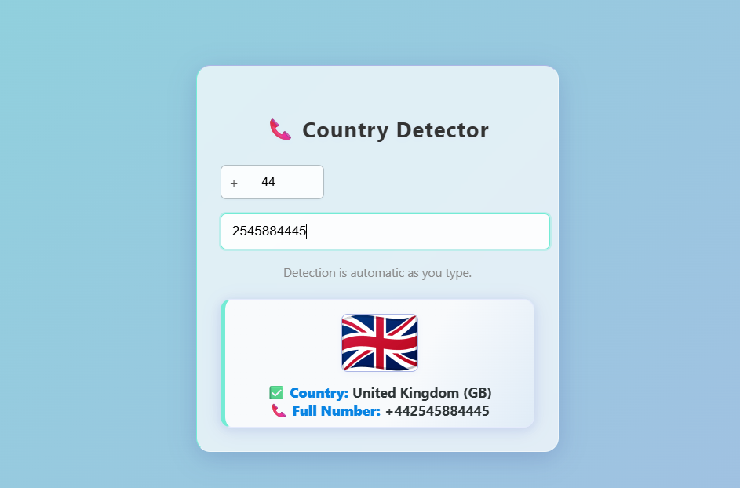

# 🌍 Country Detector

**Country Detector** is a simple web app that identifies a user's country based on their IP address (or optionally, browser geolocation). It can be used to personalize content, localize user interfaces, or track visitor origins for analytics.

---

## 🚀 Features

- 🔍 Detects user's country using IP-based geolocation
- 🌐 Optional use of the browser's Geolocation API
- 💡 Clean, lightweight, and easy to integrate
- 📦 Vanilla JavaScript – no frameworks required

---

## 📦 Technologies Used

- HTML5
- CSS3
- JavaScript (ES6+)
- External APIs (e.g., [ipapi.co](https://ipapi.co), [ipinfo.io](https://ipinfo.io), etc.)

---

## 📸 Demo



---

## 🌐 Live Demo

<a href="https://itsVir.github.io/country-detector/" target="_blank">View Live Project 🚀</a>

---

## 🛠️ How to Run Locally

```bash
# 1. Clone the repository
git clone https://github.com/itsVir/country-detector.git

# 2. Navigate to the project folder
cd country-detector

# 3. Open index.html in your browser
start index.html   # On Windows
open index.html    # On macOS


